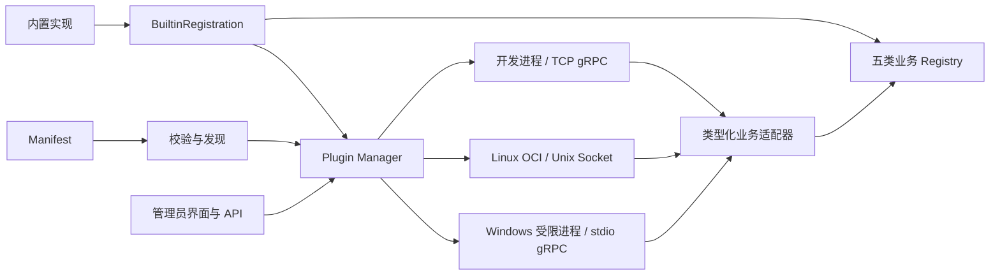

# 插件框架架构与实现

本文描述当前实现的职责与代码入口。开发步骤见[插件开发文档](../plugin/README.md)，技术取舍见[架构决策](../plugin/ADR-0001-out-of-process-plugin-runtime.md)，平台验证结果统一见[验收矩阵](../plugin/ACCEPTANCE.md)。

## 架构边界

框架通过 `plugin.yaml` 和版本化、类型化 gRPC 协议接入外部插件。插件独立构建与交付，宿主使用适配器将其接回原有业务接口。内置扩展保留进程内调用，通过 `BuiltinRegistration` 接入同一个 Manager，统一启停、状态与健康检查管理。

Windows 原生运行时与 Linux OCI 是不同的平台执行路径；普通 TCP 进程用于开发，不提供禁网隔离保证。框架不能因缺少隔离能力而静默允许原本被禁止的访问。

## Manifest 与兼容性

[Manifest 实现](../internal/plugin/manifest.go)负责插件身份、版本、扩展点、配置及权限声明。装载前校验宿主版本范围、插件 API、协议和运行时；启动后通过标准 Health 与 `GetInfo` 再核对插件身份、版本和扩展 ID。

配置 Schema 向业务界面提供动态字段。文件访问按声明限制，目前只支持受控的只读目录授权。网络声明区分直接联网、完全禁网和经宿主受控 HTTP 三种情形，详细字段与约束见[受控 HTTP 文档](../plugin/CONTROLLED-HTTP.md)。

## 发现、安装与生命周期

[Manager](../internal/plugin/manager.go)管理外部插件和内置注册。[容器初始化](../internal/container/container.go)连接 Manager 与各业务注册表。

1. 从配置的外部目录及安装目录发现 Manifest，校验后选择运行时。
2. 启动插件，确认 Health 为 `SERVING`，验证运行身份，再发布业务适配器。
3. 管理员通过插件管理界面及 API 查看状态、启用或停用。外部插件执行周期健康检查；依赖租户配置的内置能力在使用时检查实际连接。
4. 停用时摘除业务实现并释放运行资源；同步或连接验证中的数据源受到停用保护。
5. 宿主退出时关闭 Manager，释放连接、进程和容器。

[安装器](../internal/plugin/install.go)接收编译制品 ZIP，检查路径、大小、符号链接、Manifest 和重复 ID。原生插件须包含匹配宿主平台的可执行程序；OCI 包引用预构建镜像。源码工程不作为安装包执行。

[升级流程](../plugin/UPGRADES.md)要求同 ID、更高版本及协议、扩展和配置兼容。升级前停用，失败时恢复旧包；兼容升级保留业务数据，受控 HTTP 权限需要重新批准。管理员启停覆盖仍是进程级状态，重启后以 Manifest 配置为准。

## 五类扩展

| 扩展 | 协议 | 宿主适配器 |
| --- | --- | --- |
| 数据源 | [datasource.proto](../plugin/proto/datasource.proto) | [datasourcegrpc](../internal/plugin/datasourcegrpc) |
| 文档解析 | [document_parser.proto](../plugin/proto/document_parser.proto) | [documentparsergrpc](../internal/plugin/documentparsergrpc) |
| 网络搜索 | [web_search.proto](../plugin/proto/web_search.proto) | [websearchgrpc](../internal/plugin/websearchgrpc) |
| 模型厂商 | [model_provider.proto](../plugin/proto/model_provider.proto) | [modelprovidergrpc](../internal/plugin/modelprovidergrpc) |
| 检索引擎 | [retrieval_engine.proto](../plugin/proto/retrieval_engine.proto) | [retrievalgrpc](../internal/plugin/retrievalgrpc) |

各类适配器发布到原有业务 Registry，业务调用者无需了解插件进程的内部实现。注册时保护既有扩展身份，避免外部插件覆盖内置 ID。

模型插件支持 `openai_compatible` 与 `grpc_inference`：前者由宿主兼容客户端执行请求，后者由插件处理厂商鉴权、请求和响应协议。聊天及流式、向量、重排、视觉、语音的输入输出契约见[模型推理文档](../plugin/MODEL-INFERENCE.md)。

## 数据源同步链路

[独立本地目录插件](../plugin/EXTERNAL-PLUGINS.md)以相对路径和 SHA-256 保存快照。首次返回全部文件，后续仅返回新增、变化或删除事件；检查点保留恢复所需的完整历史，避免中断重试丢失尚未处理的文件状态。

[数据源适配器](../internal/plugin/datasourcegrpc/connector.go)将流式事件转交[宿主同步服务](../internal/application/service/datasource_service.go)。宿主负责知识记录、文件存储、解析、分块、Embedding、索引和日志；插件负责发现变化与返回内容，不直接管理宿主数据库。删除事件是否实际删除知识，由宿主的数据源同步设置决定。

## 权限执行与审计

| 运行路径 | 执行机制 | 边界 |
| --- | --- | --- |
| Windows 原生 | 受限身份、Job Object、只读目录授权和 stdio gRPC；WFP 拒绝事件关联插件日志 | 拒绝事件订阅需要适当 WFP 权限；普通账户不保证能够采集 |
| Linux OCI | 只读挂载与根文件系统、资源限额、移除 capabilities、禁止提权；禁网时应用 `network=none` 与 AppArmor | 必须具备相应 Linux/AppArmor 能力；Docker Desktop 不等价于 Linux 内核审计验收 |
| TCP 开发进程 | 宿主启动普通进程，通过 TCP 通信 | 不作为第三方权限隔离边界 |

`outbound: false` 且未申请宿主 HTTP 表示完全禁网；申请并获批宿主 HTTP 时，插件仍不能直接联网，由宿主按获批的域名、方法、DNS/IP、跳转、TLS 和大小限额发起请求。旧 `outbound: true` 允许直接联网，不受宿主 HTTP 规则全面保护。

策略应用日志只表示配置已应用，不能代替真实拒绝事件。具体配置和复现分别见[Windows 原生运行](../plugin/WINDOWS-NATIVE.md)、[受控 HTTP](../plugin/CONTROLLED-HTTP.md)及[Linux 安全探针](../plugin/security-probe/verify-linux.sh)。

## 文档与验证入口

- [插件开发文档](../plugin/README.md)：公共协议、Manifest、模板和构建步骤。
- [架构决策](../plugin/ADR-0001-out-of-process-plugin-runtime.md)：技术路线及替代方案。
- [验收矩阵](../plugin/ACCEPTANCE.md)：测试名称、当前状态和平台限制；原始证据位于 `docs/acceptance/`。
- [课题提交入口](submission/README.md)：成果范围、报告和运行指南。

当前未完成的 Linux 实机完整链路、第三方仅凭文档实现插件，以及各部署环境权限限制，以验收矩阵为准。本文不重复历史测试流水，也不将代码存在视为验收通过。
