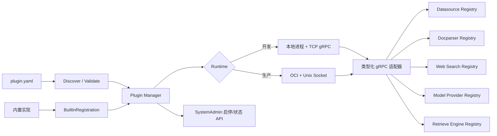

# WeKnora 扩展能力插件化框架：当前架构与实现说明

> 2026-09-11 专有模型协议扩展：新增 `grpc_inference`，支持插件执行聊天/流式、向量、重排、图片理解、语音转写。Windows 独立 EXE 经 Manager/stdio gRPC 调用 HMAC/NDJSON 参考服务已通过，取消、超时、凭证隔离和启停也已验证。旧 OpenAI 兼容方式保留。见[开发文档](../plugin/MODEL-INFERENCE.md)。本次不修改异常退出清理。

> 2026-09-11 Windows 拒绝事件验收补充：第二条已在管理员 WFP 权限环境取得真实证据，包括父/子进程禁网、四条系统拒绝事件，以及生产宿主日志链路输出的两条带插件 ID 的 `plugin.network_denied`。见[验收记录](acceptance/windows-network-audit-2026-09-11.md)。普通权限 Lite 进程的审计权限限制仍存在。

> 2026-09-11 独立仓库验收补充：课题第一条已在 Windows 完整通过。主仓外真实独立 Git 仓库构建、管理员安装启用、完整同步、解析/摘要与混合及纯向量检索全部完成，验收前后主仓工作树和宿主 EXE 哈希一致。首次新增 2 篇、无修改处理 0 篇、仅改 Alpha 更新 1 篇。见[已提交的验收记录](acceptance/windows-independent-plugin-2026-09-11.md)。下文涉及 Linux OCI 的历史缺口仍单独保留。

> 2026-09-11 更新：管理员 ZIP 安装、插件管理页面及同 ID 兼容升级已实现，见 [插件升级](../plugin/UPGRADES.md)。飞书公开链接在运行中的 Windows Lite 应用完成了导入、解析、摘要、检索和无重复增量同步的 API 验收，见 [验收矩阵](../plugin/ACCEPTANCE.md)。下文 2026-09-02 的生产式独立仓库 OCI 验收缺口仍保留，不能与这次 Windows API 验收混为一谈。`artifacts/` 中的日志和安装包是本地生成产物，不纳入源码仓库。

> 2026-09-10 受控 HTTP 更新：新增通用 `network.http` 权限、管理员摘要批准、宿主 HTTPS 执行模块和复用原连接的双向通道，提供 Go/Python SDK。插件继续禁止直接联网。域名、DNS/IP、每次跳转和限额由宿主检查。实际 Windows 受限 EXE 已通过飞书公开链接读取、未批准目标拒绝和重新启用验收；旧 `outbound: true` 插件仍不受该能力保护。详见[受控 HTTP 指南](../plugin/CONTROLLED-HTTP.md)。

> 2026-09-10 更新：Windows 已新增原生受限进程 + `stdio://` gRPC 管道运行方式，无需容器。真实进程的禁网、子进程限制、全量/单文件增量同步和 Manager 启停已在本机通过。WFP 拒绝事件作为补充审计；当前账户缺少读取权限，真实事件日志尚未在本机验证。配置和复现步骤见 [Windows 原生插件](../plugin/WINDOWS-NATIVE.md)。下文的 AppArmor 描述适用于原有 Linux OCI 路径。

> 审计日期：2026-09-02  
> 审计对象：当前工作树（包含尚未提交的插件化改动），不是仅指远端 `main` 现状。  
> 结论依据：源码走查、仓库文档、`plugin/test-windows.ps1` 本机实测。

## 1. 结论先行

当前工作树已经形成一套可运行的 **Manifest + 类型化 gRPC + OCI 沙箱** 插件框架。外部插件可由独立仓库、独立语言和独立镜像实现，通过 `WEKNORA_PLUGIN_DIRS` 被宿主发现，不再需要修改 WeKnora 核心工厂代码。数据源、文档解析、网络搜索、模型厂商和检索引擎五类扩展共用一个 `Manager` 生命周期；内置扩展虽然仍在进程内执行，也通过 `BuiltinRegistration` 接入相同的状态机和管理员启停 API。

实现并非全部达到“无条件验收完成”。准确状态如下：

| 验收项 | 当前判断 | 证据与边界 |
| --- | --- | --- |
| 主仓外插件无需改主仓即可装载并同步 | Windows 验收通过（2026-09-11） | 独立 Git 仓库从零构建原生 EXE，正常安装/启用及完整同步，真实解析、摘要、Embedding、索引、混合与纯向量检索均通过；主仓及宿主 EXE 在验收期间未变。Linux OCI 镜像链路仍需独立验证。 |
| 声明不联网时实际无法出站，且尝试被记录 | Windows 管理员 WFP 环境验收通过（2026-09-11） | 父/子进程 TCP 拒绝、UDP 非送达及真实 WFP 拒绝事件已验证，生产日志包含插件 ID 和目标信息。普通权限宿主仍可能 `attempt_audit: false`；原有 OCI/AppArmor 的 Linux 验收状态不变。 |
| 单文件变化只重处理该文件 | 满足，本机实测通过 | 示例以 `relative_path -> SHA-256` 保存游标；插件单测、gRPC 往返测试和宿主 `ProcessSync` + SQLite 集成测试均通过。 |
| 他人仅依据文档实现最简插件 | 工程材料齐备，仍需第三方验证 | `plugin/README.md` 和自包含 `plugin/templates/datasource-python` 已提供；CI 从模板目录自身构建镜像。尚无真实第三方“只看文档复现”的记录。 |

因此，当前框架适合作为 **v1alpha1 可评审实现**。Windows 独立仓库到可检索知识的完整链路，以及管理员权限下的真实联网拒绝日志均已通过。正式宣称全部验收完成前，仍需第三方仅凭文档复现的证据，并明确部署所需的 WFP 权限；Linux 路径另需 AppArmor 拒绝日志及 OCI 完整链路验收。

## 2. 与原有扩展机制的关系

官方[扩展点机制](https://github.com/Tencent/WeKnora/blob/main/website-docs/06-development/03-extension-points.md)描述的基线以编译期注册为主：文档解析器有 Python 注册表，检索引擎、网络搜索和数据源主要由 Go 容器/工厂集中注册，模型厂商则由全局 Provider 注册表及各模型构造逻辑共同决定。相关业务背景可参见[数据源](https://github.com/Tencent/WeKnora/blob/main/website-docs/03-features/10-datasource.md)、[文档解析](https://github.com/Tencent/WeKnora/blob/main/website-docs/03-features/03-document-parsing.md)、[网络搜索](https://github.com/Tencent/WeKnora/blob/main/website-docs/03-features/11-web-search.md)、[模型管理](https://github.com/Tencent/WeKnora/blob/main/website-docs/03-features/06-models.md)和[检索引擎](https://github.com/Tencent/WeKnora/blob/main/website-docs/03-features/05-retrieval-engines.md)。

本次实现没有推翻原有业务接口，而是在外侧增加稳定的进程边界和宿主适配器：



这样做保留了现有调用方：知识库同步、解析、搜索、模型配置和检索服务仍面向原有 Go 接口；只有装载方式从“核心代码里写死构造函数”扩展为“内置回调或外部 gRPC 适配器”。

## 3. 技术路线与取舍

### 3.1 最终选择

选择由三层组成：

1. `plugin.yaml` 负责声明身份、兼容范围、配置 Schema、权限和运行时；
2. 每类扩展使用独立、带版本的 protobuf/gRPC 服务作为 ABI；
3. 生产插件运行在 OCI 容器中，通过私有 Unix Domain Socket 与宿主通信；本地 TCP gRPC 仅用于开发。

### 3.2 为什么不是“只统一编译期元数据”

统一元数据只能解决注册风格不一致，不能让主仓外代码在不重新编译 WeKnora 的情况下被加载，也不能限制插件的网络、文件系统和进程权限。因此它可以作为内置扩展整理手段，但不足以完成本课题的独立仓库和运行期权限验收。

### 3.3 为什么使用类型化 gRPC

- 多语言：Go、Python、Java 等都可依据 Proto 生成客户端/服务端；
- 契约清晰：编译期就能发现方法或字段不兼容；
- 原生支持健康检查、超时、取消和服务端流，适合大规模数据源同步与解析输出；
- 版本边界独立于宿主源码，不要求插件导入 `internal/` Go 包。

没有采用单一 `Invoke(method, json)`，是因为它会把拼写、类型和协议错误推迟到线上请求阶段。当前实现只在“扩展自身天然开放”的位置保留 JSON，例如数据源的配置和游标、检索协议中的公开 SDK 请求体。

### 3.4 传输选择（含后续 stdio 扩展）

- Go `plugin` 对 Go 版本、依赖图、OS、架构和 ABI 高度敏感，且与宿主同权限运行；
- stdio 现在复用 HTTP/2 gRPC，Go listener 和 Python `StdioServer` 已提供流量控制、取消与健康检查；Windows 禁网插件使用该管道，不建立 TCP 回环监听；
- 纯 TCP gRPC 无法同时做到控制通道可达和插件网络命名空间完全关闭，因此仅保留为开发模式；
- WebAssembly 适合未来的确定性解析类插件，但当前对大型 SDK、原生库、流式客户端和受控文件系统的支持不如 OCI 普适。

### 3.5 为什么 OCI + Unix Socket

OCI 让权限声明可以落到真实操作系统/容器策略。Unix Socket 只挂载到宿主和插件之间，即使容器 `network=none`，控制面仍可通信。相比仅做应用层 HTTP 拦截，该方案还能约束插件自己携带的 SDK 或原生代码。

正式决策记录见 `plugin/ADR-0001-out-of-process-plugin-runtime.md`。

## 4. 插件描述文件

Manifest 的 Go 模型位于 `internal/plugin/manifest.go`，API 版本为 `plugins.weknora.io/v1alpha1`。

| 字段 | 作用 | 校验/处理函数 |
| --- | --- | --- |
| `metadata.id/name/version` | 全局身份、展示名、SemVer | `LoadManifest`、`Manifest.Validate` |
| `spec.extensionPoints[]` | 扩展类型、扩展 ID、协议版本、能力、UI 元数据 | `Manifest.Validate`；v1alpha1 每个运行时仅允许一个扩展点 |
| `spec.compatibility.weknora` | 宿主 SemVer 范围 | `Manifest.Validate` 使用 `semver.ParseRange` |
| `spec.compatibility.pluginAPI` | 插件 API 版本 | 当前只接受 `v1` |
| `spec.runtime` | `grpc` 或 `oci`、地址/镜像/命令、挂载和资源限制 | `startManagedRuntime`、`ociPluginRuntime.Start` |
| `spec.configSchema` | JSON Schema 配置表单；敏感字段进入凭据存储 | 各 Loader 转为业务元数据，前端动态展示 |
| `permissions.network` | 是否允许出站；预留 allowlist | v1alpha1 不接受无法落实的 allowlist |
| `permissions.filesystem` | 可读/可写路径 | 当前仅支持声明并只读挂载；写权限被拒绝 |

支持的扩展类型常量为：`datasource`、`document_parser`、`web_search`、`model_provider`、`retrieval_engine`。

设计上采用 fail-closed：无法执行的权限声明不会静默扩大。例如 v1alpha1 会拒绝写目录、域名 allowlist，以及 TCP gRPC 插件的 `outbound: false`。

## 5. 发现、装载和生命周期

### 5.1 启动链路

1. `internal/container/container.go:initConnectorRegistry` 读取 `VERSION`/`WEKNORA_VERSION`，创建 `plugin.NewManager`；
2. 内置数据源、解析器、模型厂商和检索引擎分别通过 `registerBuiltinDatasource`、`registerBuiltinDocumentParsers`、`registerBuiltinModelProviders`、`registerBuiltinRetrievalEngines` 登记；网络搜索由 `registerWebSearchProviders` 登记；
3. `filepath.SplitList(os.Getenv("WEKNORA_PLUGIN_DIRS"))` 解析一个或多个插件根目录；
4. `Manager.LoadDirectories` 调用 `Discover`，寻找根目录本身或一级子目录中的 `plugin.yaml`；
5. `LoadManifest`/`Manifest.Validate` 在执行插件代码前检查身份、版本、扩展类型、运行时和权限；
6. `startManagedRuntime` 启动本地进程，或由 `ociPluginRuntime.Start` 创建容器；
7. 对应的 `Dial` 先调用标准 `grpc.health.v1.Health/Check`，再调用 `GetInfo` 核对插件 ID、版本、协议版本和扩展 ID；
8. Loader 返回实现宿主原有业务接口的适配器，容器层把它注册到相应业务 Registry；
9. `Manager.StartHealthChecks(30 * time.Second)` 启动周期健康检查；
10. `ResourceCleaner` 在宿主退出时调用 `Manager.Close`，关闭连接、进程和容器。

任何插件装载错误会聚合到容器构建错误，并清理由宿主已经启动的插件，避免残留孤儿进程/容器。

### 5.2 统一状态机

`internal/plugin/manager.go` 定义 `disabled -> starting -> healthy/unhealthy -> stopped`，另有 `ignored` 表示宿主尚不支持的类型。核心函数如下：

| 函数 | 责任 |
| --- | --- |
| `NewManager` | 初始化状态、Manifest、内置注册和运行时集合 |
| `LoadDirectories` / `Load` | 发现并启动默认启用的外部插件 |
| `RegisterBuiltin` | 通过 Enable/Disable/Health 回调把进程内实现接入同一状态机 |
| `StartHealthChecks` | 为五类外部插件及有探针的内置插件启动周期检查 |
| `Enable` | 动态启动、健康验证外部插件，或调用内置 Enable 回调 |
| `Disable` | 停止健康检查并释放 gRPC、进程或容器；业务 Registry 先由 Handler 摘除 |
| `Statuses` | 按插件 ID 返回确定顺序的运行状态 |
| `Close` | 关闭所有监控和运行时，状态转为 `stopped` |

内置和外部的“统一”指统一生命周期、状态和管理 API，而不是强迫内置代码也变成 gRPC。内置扩展仍直接调用原有 Go 实现，以免引入不必要的序列化和部署成本。

### 5.3 管理 API

`internal/router/routes_plugin.go:RegisterPluginAdminRoutes` 在 SystemAdmin 权限下提供：

```text
GET  /api/v1/system/admin/plugins
POST /api/v1/system/admin/plugins
POST /api/v1/system/admin/plugins/:plugin_id/enable
POST /api/v1/system/admin/plugins/:plugin_id/disable
```

`POST /plugins` 仅允许系统管理员上传 ZIP 包。安装器在 64 MiB 压缩包、256 MiB
解压体积和 2048 个条目的边界内校验路径穿越、符号链接、Manifest 兼容性及重复
ID。上传包只接受编译制品：`grpc` 的 `runtime.command` 必须是匹配宿主操作系统的
PE/ELF/Mach-O 可执行文件，`oci` 必须引用预构建镜像；源码、脚本和构建清单均被
拒绝。校验成功后才原子落盘到 `WEKNORA_PLUGIN_INSTALL_DIR`。普通用户没有安装或启停
权限，但启用后的数据源扩展会通过统一 Registry 出现在普通数据源列表中。

`internal/handler/plugin.go` 中的 `PluginHandler.List/Install/Enable/Disable` 负责 Manager 与五个业务 Registry 之间的原子化编排；`rollbackEnable` 在部分注册失败时撤销已发布项并停止运行时。

当前限制：管理员启停覆盖只存在于当前进程，重启后仍以 `plugin.yaml` 的 `spec.enabled` 为准。

## 6. 五类扩展如何接入

| 扩展 | Proto/主要 RPC | 宿主适配器与 Loader | 业务注册点 |
| --- | --- | --- | --- |
| 数据源 | `datasource.proto`: `GetInfo`、`Validate`、`ListResources`、`ResolveResourceAncestors`、流式 `Fetch` | `datasourcegrpc.Connector`、`LoadDatasources` | `ConnectorRegistry.Register`、`RegisterConnectorMetadata` |
| 文档解析 | `document_parser.proto`: `GetInfo`、流式 `Parse` | `documentparsergrpc.Connector`、`LoadDocumentParser` | `docparser.RegisterExternalEngine` |
| 网络搜索 | `web_search.proto`: `GetInfo`、`Search` | `websearchgrpc.Connector`、`LoadWebSearch` | `web_search.Registry.RegisterExternal` |
| 模型厂商 | `model_provider.proto`: `GetInfo`、`ValidateConfig`、`Infer`、`InferStream` | `modelprovidergrpc.Connector`、`LoadModelProvider`、五类模型工厂适配 | `provider.RegisterExternal` |
| 检索引擎 | `retrieval_engine.proto`: `GetInfo`、`Upsert`、`Search`、`Delete`、`Copy`、`Update`、`Estimate` | `retrievalgrpc.Engine`、`LoadRetrievalEngine` | `RetrieveEngineRegistry.RegisterExternal` 和 `types.RegisterExternalRetrieverEngine` |

各业务 Registry 都增加了线程安全的外部注册/摘除能力，并保护内置 ID 不被外部实现覆盖：

- 数据源：`internal/datasource/connector.go` 的 `ConnectorRegistry.Register/Unregister` 与元数据注册函数；
- 文档解析：`internal/infrastructure/docparser/engine_registry.go` 的 `RegisterBuiltinEngine`、`RegisterExternalEngine`、`UnregisterExternalEngine`；
- 网络搜索：`internal/infrastructure/web_search/registry.go` 的 `RegisterBuiltin`、`RegisterExternal`、`Types`；
- 模型厂商：`internal/models/provider/provider.go` 的 `RegisterBuiltin`、`RegisterExternal`、`UnregisterExternal`；
- 检索引擎：`internal/application/service/retriever/registry.go` 的 `RegisterExternal`、`UnregisterExternal`。

模型插件现有两种 transport：`openai_compatible` 保留元数据/校验和宿主兼容客户端；新增 `grpc_inference` 通过独立进程执行五类模型请求，厂商专有认证、请求与流事件映射由插件承担。公共 SDK 定义输入/输出 JSON 契约，宿主保持统一业务接口。其他未支持的 transport 仍会被拒绝。

## 7. 数据源示例与增量同步

示例位于 `examples/plugins/local-directory`，默认以 OCI 运行并把宿主目录只读挂载为 `/data`。

### 7.1 插件侧算法

`examples/plugins/local-directory/main.go` 的关键函数是：

- `server.Fetch`：解析配置与旧游标、扫描文件、发送变化项/删除项/checkpoint/final cursor；
- `scan`：跳过符号链接，筛选受支持格式，计算 SHA-256，按相对路径排序；
- `parseCursor` / `encodeCursor`：维护 `relative_path -> SHA-256` 完整快照；
- `secureJoin`：阻止资源路径越出声明根目录；
- `selectedPath`：限制同步到用户选择的文件或子树。

同步规则是：新路径发送创建事件；同路径哈希变化发送更新事件；旧快照存在而新快照缺失时发送 `is_deleted=true`；哈希相同不发送，因此不会进入宿主解析和索引链路。

### 7.2 宿主侧链路

`internal/plugin/datasourcegrpc/connector.go:FetchStream` 把 gRPC `FetchEvent` 转为现有 `datasource.StreamHandler` 调用。`internal/application/service/datasource_service.go` 中：

1. `DataSourceService.ProcessSync` 检测 `datasource.StreamingConnector`；
2. `processSyncStreaming` 从 `LastSyncCursor` 恢复，调用插件 `FetchStream`；
3. `streamSyncHandler.Emit`/`applyFetchedItem` 执行创建、更新或删除；
4. `streamSyncHandler.Checkpoint` 在长同步中持久化阶段游标；
5. 成功结束后保存 final cursor，下一轮仅请求增量。

这使外部插件只负责“发现变化并返回原始内容”，数据库写入、文件存储、解析、分块、Embedding、索引和同步日志仍归宿主负责，避免第三方插件直接持有 WeKnora 数据库权限。

## 8. 权限隔离与审计

`internal/plugin/oci_runtime.go:ociPluginRuntime.Start` 把 Manifest 落实为：

- 声明目录只读 bind mount；
- 根文件系统 `ReadonlyRootfs: true`；
- `CapDrop: [ALL]`；
- `no-new-privileges`；
- `/tmp` 为 `noexec,nosuid,nodev` 的限额 tmpfs；
- 默认 256 MiB 内存、1 CPU、128 PID，也可在 Manifest 中收紧；
- `outbound: false` 时同时设置 `NetworkMode: none` 和 `apparmor=weknora-plugin-no-network`；
- 控制面只挂载随机权限目录下的 Unix Socket，不暴露 TCP 端口。

AppArmor 规则位于 `deploy/apparmor/weknora-plugin-no-network`，对 IPv4/IPv6 socket 使用 `audit deny`。容器策略应用结果由 `recordPolicyEvent` 记录为结构化 `plugin-security-audit` 日志；真实违规尝试由内核 AppArmor 审计记录。`plugin/security-probe/verify-linux.sh` 会实际执行 `connect(2)`，同时断言连接失败和内核日志存在 `DENIED`/`family="inet"`。

重要边界：Docker Desktop 的 Windows/macOS 环境不能提供与 Linux AppArmor 等价的宿主审计。严格安全验收必须在启用 AppArmor 的 Linux Docker 节点执行；否则不能仅凭 HostConfig 单测宣称“联网尝试已被拦截并记录”。

## 9. 模板、文档和测试证据

### 9.1 开发材料

- `plugin/README.md`：运行模型、Manifest、五类协议、示例构建、管理员 API；
- `plugin/proto/*.proto`：五类版本化协议；
- `plugin/templates/datasource-python`：可复制到空仓库的自包含 Python 模板，拥有自己的 Proto、依赖、服务、Manifest 和 Dockerfile；
- `examples/plugins/*`：本地目录、纯文本解析、Mock 搜索、Mock 模型厂商、内存检索五个示例；
- `plugin/ACCEPTANCE.md`：把验收项映射到自动化证据；
- `.github/workflows/plugin.yml`：Linux 合约/镜像构建，以及手动 AppArmor 真拒绝任务。

### 9.2 本次实测

在 Windows 工作区执行：

```powershell
powershell -ExecutionPolicy Bypass -File plugin/test-windows.ps1
```

结果：

- `./internal/plugin/...`：通过；
- `./plugin/proto`：通过；
- 五个 `./examples/plugins/...`：通过；
- `TestPluginIncrementalSyncOnlyReprocessesChangedFile`：通过；
- 前端 `vue-tsc --build`：通过；
- 脚本最终输出 `Windows plugin acceptance passed.`。

另行尝试了 CI 中的 `go test ./internal/container` 与
`go test ./internal/handler -run '^TestPluginHandler'`。二者在本机分别停在
`sqlite-vec`/`duckdb` 的 cgo 构建和 Windows `ld` 链接（exit status 53），未进入
测试用例；这属于本次 Windows 原生工具链限制，不能记作测试通过，也没有产生指向
插件业务逻辑失败的断言。对应测试仍应以 `.github/workflows/plugin.yml` 的 Linux CI
结果为合入依据。

Linux AppArmor 实际拒绝未在本机执行，应在目标节点运行：

```bash
sudo apparmor_parser -r deploy/apparmor/weknora-plugin-no-network
sudo --preserve-env=PATH sh plugin/security-probe/verify-linux.sh
```

## 10. 尚存风险与建议

1. **改动尚未提交。** 本文描述的是当前工作树；在合并前应完成代码评审、生成代码一致性检查和 CI。
2. **安全验收依赖 Linux。** 建议把 AppArmor job 从仅 `workflow_dispatch` 提升为受控自托管 runner 的必跑门禁，并保存内核审计日志作为制品。
3. **“完整同步”证据还可加强。** 现有测试已覆盖插件 gRPC、宿主 SQLite 落库和解析任务只新增一次；建议再加独立仓库 OCI 镜像 -> 实际 parser worker -> chunk -> embedding -> retrieval 的黑盒 E2E。
4. **第三方可用性尚未做人员验证。** 安排未参与实现的人仅复制 Python 模板和阅读 README 完成改名、构建、装载、首次同步与增量同步，并把发现的问题反哺文档。
5. **启停状态不持久。** 若需要运维一致性，应把管理员覆盖写入系统配置/数据库，并规定它与 Manifest 默认值的优先级。
6. **专有模型需要逐厂商适配。** 推理扩展通道和专有协议参考实现已通过 Windows 测试，但不等于所有商业厂商已经适配；需用真实账号验证各厂商实现。
7. **v1alpha1 权限表达保守。** 写目录和域名 allowlist 被直接拒绝是正确的 fail-closed 行为；后续只有在能可靠执行、审计和按租户回收后再开放。

## 11. 最终评价

从架构方向看，当前选择与题目目标一致：Manifest 解决声明和兼容性，类型化 gRPC 解决独立仓库与多语言 ABI，OCI/Unix Socket 解决运行期隔离，统一 Manager 解决内置/外部扩展的生命周期一致性。它比只整理编译期注册更能支撑社区生态，也比同进程动态链接更稳定、更安全。

从交付成熟度看，主体实现和 Windows 功能验收已经成立；剩余工作主要是 **生产环境级证据补齐**，而不是重新设计核心框架。建议以 v1alpha1 合入，在 Linux 安全门禁和独立仓库全链路 E2E 完成后，再将四项验收统一标记为最终通过。
